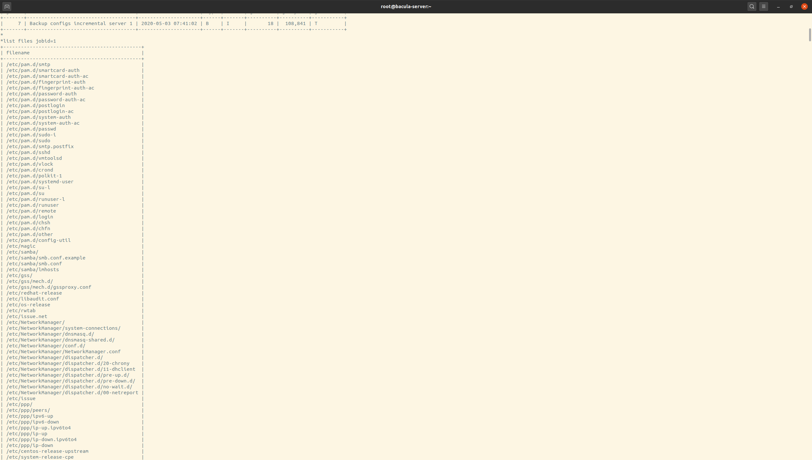

Домашнее задание 17

Настроить политику бэкапа директории /etc с клиента:
1) Полный бэкап - раз в день
2) Инкрементальный - каждые 10 минут
3) Дифференциальный - каждые 30 минут

Запустить систему на два часа. 
Для сдачи ДЗ приложить list jobs, list files jobid="id" и сами конфиги bacula-*

Результат:
    Запуск лабораторной работы: 
    cd vagrant-bacula; vagrant up

Screenshot:
* list jobs

* list files jobid=1

* list files jobid=7
